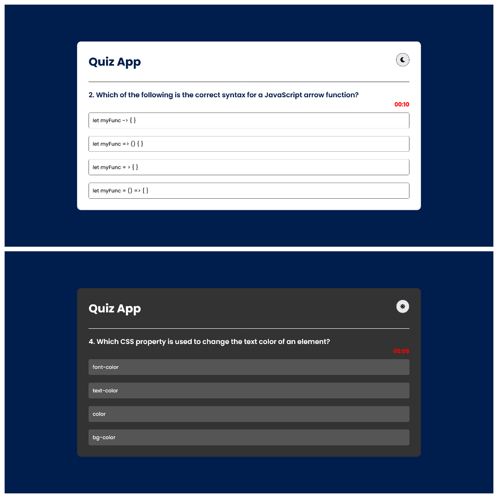
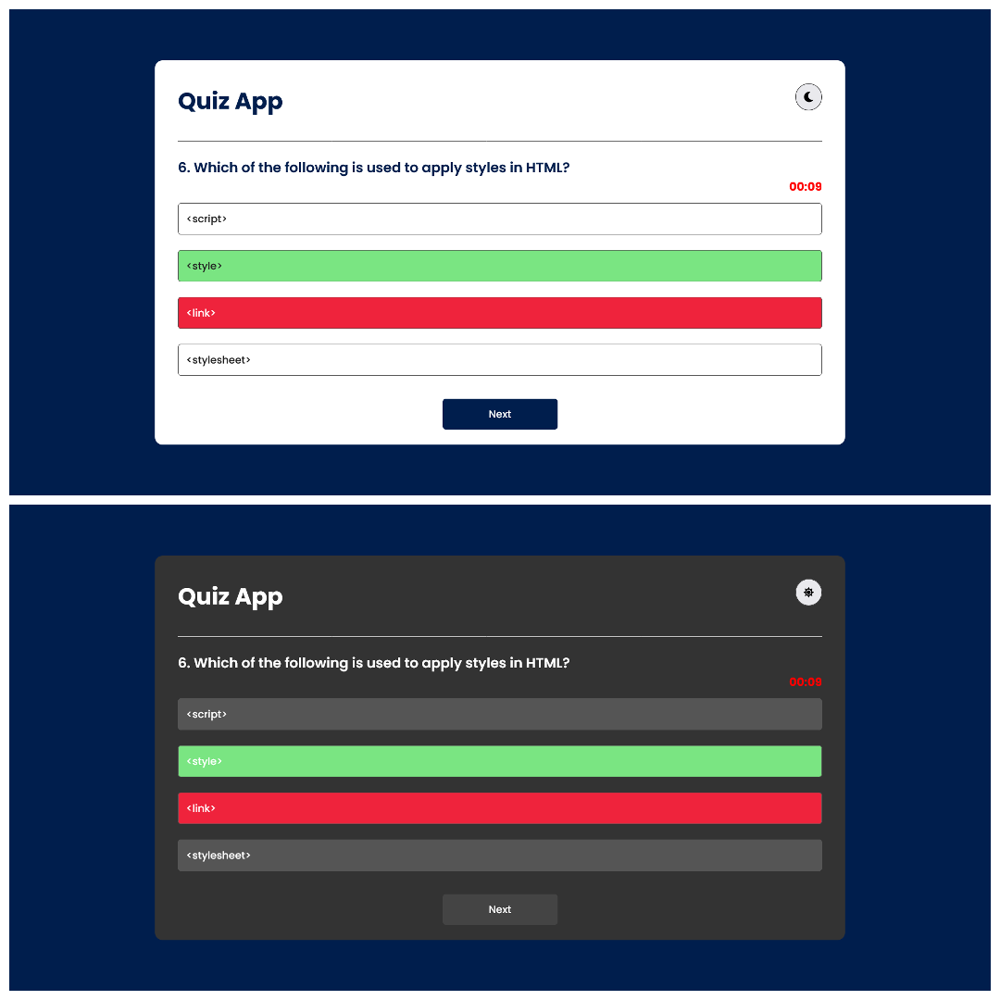

# Quiz-Web-App

A user-friendly quiz interface that engages users and provides a seamless experience

### Screenshot

#### Start Page

#### Questions List

#### Correct Answer

#### Incorrect Answer

#### Score Page

### Links

- Live Site URL: (https://classy-kleicha-f709a8.netlify.app)

### Built with

- Semantic HTML5 markup
- CSS
- Javascript(ES6)

### Useful resources

- [Resource 1](https://www.youtube.com/@KevinPowell) - This channel helped me a lot to understand and improve my CSS skills.
- [Resource 2](https://www.youtube.com/playlist?list=PLu71SKxNbfoBuX3f4EOACle2y-tRC5Q37) - This is the best playlist for anyone learning Javascript. His immense teaching gave me confidence to use and implement JS efficiently.
